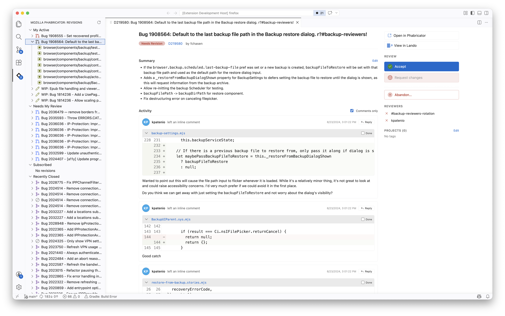

# Phabricator Review

Review and create revisions on Mozilla's [Phabricator](https://phabricator.services.mozilla.com/) instance.



## Getting started

1. Open the Phabricator activity-bar view in the sidebar.
2. Click **Sign In**.
3. Paste a Conduit API token from [phabricator.services.mozilla.com/conduit/login](https://phabricator.services.mozilla.com/conduit/login) (or whichever Phabricator instance you've configured under `phabricator.baseUrl`).

The token is stored in VS Code's `SecretStorage`. Sign out at any time via the **Phabricator: Sign Out** command.

## Features

- **Browse revisions** in a sidebar grouped into "My Active", "Needs My Review", "Subscribed", and "Recently Closed". An activity-bar badge counts revisions waiting on you.
- **Inspect a revision**: open the overview panel for the title, summary, test plan, reviewers, projects, files, and full activity timeline.
- **Diff each changed file** in a side-by-side editor via the `phab://` URI scheme — including renames and binary changes.
- **Inline comments**: read existing inline threads, reply to them, and mark them done in the activity feed or as VS Code comment threads on the diffs.
- **Submit a commit**: turn a local git commit into a new revision (or update an existing one).
- **Searchfox** Use the Searchfox CLI as a link picker for files and symbols (requires `searchfox-cli` on `PATH`) when writing comments.

## Settings

- `phabricator.baseUrl` — Conduit API endpoint, ending with `/api/`. Defaults to Mozilla's instance.
- `phabricator.refreshIntervalSeconds` — how often to poll for updates while the editor is focused. Default `900` (15 minutes).
- `phabricator.landoBaseUrl` — base URL for the **View in Lando** action. Default `https://lando.moz.tools/`.
- `phabricator.searchfoxRepo` — Searchfox repo identifier used for inserted links. Default `firefox-main`. Other options include `mozilla-central`, `comm-central`, `autoland`, etc.

## Searchfox links

The comment composer toolbar has two trailing buttons (also bound to ⌘F for files):

- **File search** — type a path fragment, pick a file, the link inserts the filename and points at its Searchfox source page.
- **Symbol search** — type any text, pick a match, the link uses the typed text as its display and points at the line in Searchfox.

Both shell out to [`searchfox-cli`](https://crates.io/crates/searchfox-cli). Install it with `cargo install searchfox-cli`.

## Development

```sh
npm install
npm run build       # production webpack (extension + webview bundles)
npm run watch       # dev rebuild loop
npm run compile     # type-check the extension host
npm run lint        # eslint over src/ and webviews/
npm test            # client + composer/serializer tests
npm run package     # build a .vsix
```

The Conduit API client lives in `src/client/` as JSDoc-typed JS with no VS Code dependencies; tests run via `node --test` in `test/client/`.

## License

MPL-2.0. See the `LICENSE` file in the source tree.
